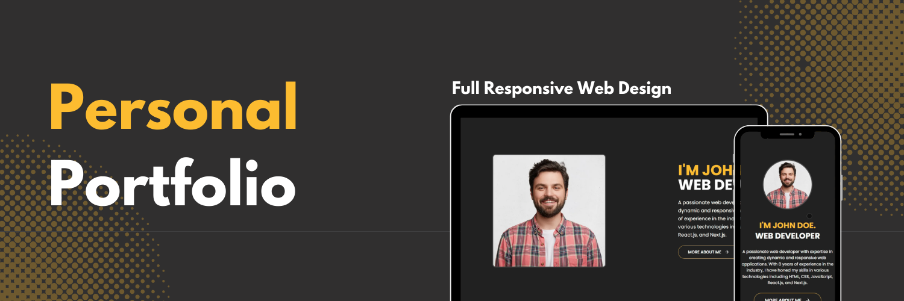

<div align="center">
  <br />
    <a href="https://youtu.be/51Hpb76SCII" target="_blank">
      
    </a>
  <br />

  <div>
    
    
    
    
  </div>

  <h3 align="center">Personal Portfolio Website</h3>

<div align="center">
     Build this project step by step with a detailed tutorial on <a href="https://www.youtube.com/@codespirit369/videos" target="_blank"><b>Code Spirit</b></a> YouTube. 
    </div>
</div>

## 📋 <a name="table">Table of Contents</a>

1. 🎬 [Introduction](#introduction)
2. ⚙️ [Tech Stack](#tech-stack)
3. 🔋 [Features](#features)
4. 🚀 [Quick Start](#quick-start)
5. 🕸️ [Snippets (Code to Copy)](#snippets)
6. 🔗 [Assets](#links)

## 🚨 Tutorial

This repository contains the code corresponding to an in-depth tutorial available on our YouTube channel, <a href="https://www.youtube.com/@codespirit369/videos" target="_blank"><b>Code Spirit</b></a>.

<a href="https://youtu.be/51Hpb76SCII" target="_blank"></a>

## <a name="tech-stack">⚙️ Tech Stack</a>

- React.js
- Next.js
- Typescript
- TailwindCSS

## <a name="introduction">🎬 Introduction</a>

Welcome to the Personal Portfolio Website project! This portfolio showcases your skills, experiences, projects, and contact information in a clean and professional manner. Built with modern technologies like Next.js, TypeScript, TailwindCSS, and ShadCN UI, this portfolio ensures an optimal user experience on all devices.

## <a name="features">🔋 Features</a>

👉 **Hero Section**: A welcoming section with your name, profession, and a brief introduction.

👉 **About Section**: A detailed section about your background and professional journey.

👉 **Skills Section**: A display of your technical skills with visual progress indicators.

👉 **Experiences Section**: A timeline of your professional experiences and achievements.

👉 **Projects Section**: A showcase of your projects with descriptions and links.

👉 **Contact Me Section**: A contact form for visitors to reach out to you.

👉 **Responsive Design**: Ensures optimal viewing experience on all devices.

## <a name="quick-start">🚀 Quick Start</a>

Follow these steps to set up the project locally on your machine.

**Prerequisites**

Make sure you have the following installed on your machine:

- [Git](https://git-scm.com/)
- [Node.js](https://nodejs.org/en)
- [npm](https://www.npmjs.com/) (Node Package Manager)

**Cloning the Repository**

```bash
git clone https://github.com/code-spirit-369/personal-portfolio-website.git
cd personal-portfolio-website
```

**Installation**

Install the project dependencies using npm:

```bash
npm install
```

**Running the Project**

```bash
npm run dev
```

Open [http://localhost:3000](http://localhost:3000) in your browser to view the project.

## <a name="snippets">🕸️ Code Snippets</a>

<details>
<summary><code>data.json</code></summary>

```typescript
{
  "name": "John Doe",
  "role": "Web Developer",
  "bio": "A passionate web developer with expertise in creating dynamic and responsive web applications. With 8 years of experience in the industry, I have honed my skills in various technologies including HTML, CSS, JavaScript, React.js, and Next.js.",
  "first_name": "John",
  "last_name": "Doe",
  "age": 30,
  "nationality": "American",
  "location": "New York, USA",
  "phone": "+1 234 567 890",
  "email": "johndoe@example.com",
  "github_handle": "johndoe",
  "languages": ["English", "Spanish"],
  "years_of_experience": 8,
  "projects_completed": 50,
  "happy_customers": 40,
  "awards_gained": 5,
  "skills": [
    {
      "skill": "HTML",
      "percentage": 90
    },
    {
      "skill": "CSS",
      "percentage": 85
    },
    {
      "skill": "JavaScript",
      "percentage": 80
    },
    {
      "skill": "React.js",
      "percentage": 75
    },
    {
      "skill": "Next.js",
      "percentage": 70
    },
    {
      "skill": "Node.js",
      "percentage": 65
    },
    {
      "skill": "MongoDB",
      "percentage": 60
    }
  ],
  "experiences": [
    {
      "year": "2020-Present",
      "title": "Senior Web Developer",
      "company": "Tech Solutions Inc.",
      "description": "Led a team of developers to create responsive web applications. Enhanced user experience through innovative design and implementation."
    },
    {
      "year": "2017-2020",
      "title": "Web Developer",
      "company": "Creative Minds LLC",
      "description": "Developed and maintained websites for various clients. Collaborated with designers to bring creative concepts to life."
    },
    {
      "year": "2015-2017",
      "title": "Junior Web Developer",
      "company": "Web Solutions Ltd.",
      "description": "Assisted in the development of web applications. Gained experience in front-end and back-end technologies."
    },
    {
      "year": "2013-2017",
      "title": "Bachelor of Science in Computer Science",
      "company": "University of Technology",
      "description": "Graduated with honors. Focused on web development and software engineering."
    }
  ],
  "projects": [
    {
      "imageUrl": "/images/1.png",
      "title": "ChatBot",
      "url": "https://www.example.com/chatbot"
    },
    {
      "imageUrl": "/images/2.png",
      "title": "AI Image Generator",
      "url": "https://www.example.com/image-generator"
    },
    {
      "imageUrl": "/images/3.png",
      "title": "Weather App",
      "url": "https://www.example.com/weather-app"
    }
  ],
  "social_links": [
    {
      "icon": "/images/linkedin.svg",
      "url": "https://www.linkedin.com/in/johndoe"
    },
    {
      "icon": "/images/twitter.svg",
      "url": "https://www.twitter.com/johndoe"
    },
    {
      "icon": "/images/github.svg",
      "url": "https://www.github.com/johndoe"
    },
    {
      "icon": "/images/instagram.svg",
      "url": "https://www.instagram.com/johndoe"
    }
  ]
}

```

</details>

<details>
<summary><code>components/skill-progress.tsx</code></summary>

```typescript
"use client";

import {
  Label,
  PolarGrid,
  PolarRadiusAxis,
  RadialBar,
  RadialBarChart,
} from "recharts";
import { ChartContainer } from "@/components/ui/chart";
import { Card, CardContent } from "@/components/ui/card";

type Props = {
  skill: {
    skill: string;
    percentage: number;
  };
};

export function SkillProgress({ skill }: Props) {
  const chartData = [{ percentage: skill.percentage, fill: "#fcbc30" }];

  return (
    <Card className="flex flex-col bg-transparent border-none">
      <CardContent className="flex-1 pb-0">
        <ChartContainer
          config={{}}
          className="mx-auto aspect-square max-h-[250px]"
        >
          <RadialBarChart
            data={chartData}
            startAngle={90}
            endAngle={90 + 3.6 * chartData[0].percentage}
            innerRadius={80}
            outerRadius={110}
          >
            <PolarGrid
              gridType="circle"
              radialLines={false}
              stroke="none"
              className="first:fill-[#4A4A4A] last:fill-[#222222]"
              polarRadius={[86, 74]}
            />
            <RadialBar dataKey="percentage" />
            <PolarRadiusAxis tick={false} tickLine={false} axisLine={false}>
              <Label
                content={({ viewBox }) => {
                  if (viewBox && "cx" in viewBox && "cy" in viewBox) {
                    return (
                      <text
                        x={viewBox.cx}
                        y={viewBox.cy}
                        textAnchor="middle"
                        dominantBaseline="middle"
                      >
                        <tspan
                          x={viewBox.cx}
                          y={viewBox.cy}
                          className="fill-white text-4xl font-semibold"
                        >
                          {chartData[0].percentage.toLocaleString()}%
                        </tspan>
                      </text>
                    );
                  }
                }}
              />
            </PolarRadiusAxis>
          </RadialBarChart>
        </ChartContainer>

        <p className="text-center text-white text-2xl">{skill.skill}</p>
      </CardContent>
    </Card>
  );
}
```

</details>

<details>
<summary><code>app/global.css</code></summary>

```typescript
@tailwind base;
@tailwind components;
@tailwind utilities;

@layer base {
  :root {
    --background: 0 0% 100%;
    --foreground: 222.2 84% 4.9%;
    --card: 0 0% 100%;
    --card-foreground: 222.2 84% 4.9%;
    --popover: 0 0% 100%;
    --popover-foreground: 222.2 84% 4.9%;
    --primary: 222.2 47.4% 11.2%;
    --primary-foreground: 210 40% 98%;
    --secondary: 210 40% 96.1%;
    --secondary-foreground: 222.2 47.4% 11.2%;
    --muted: 210 40% 96.1%;
    --muted-foreground: 215.4 16.3% 46.9%;
    --accent: 210 40% 96.1%;
    --accent-foreground: 222.2 47.4% 11.2%;
    --destructive: 0 84.2% 60.2%;
    --destructive-foreground: 210 40% 98%;
    --border: 214.3 31.8% 91.4%;
    --input: 214.3 31.8% 91.4%;
    --ring: 222.2 84% 4.9%;
    --radius: 0.5rem;
    --chart-1: 12 76% 61%;
    --chart-2: 173 58% 39%;
    --chart-3: 197 37% 24%;
    --chart-4: 43 74% 66%;
    --chart-5: 27 87% 67%;
  }

  .dark {
    --background: 222.2 84% 4.9%;
    --foreground: 210 40% 98%;
    --card: 222.2 84% 4.9%;
    --card-foreground: 210 40% 98%;
    --popover: 222.2 84% 4.9%;
    --popover-foreground: 210 40% 98%;
    --primary: 210 40% 98%;
    --primary-foreground: 222.2 47.4% 11.2%;
    --secondary: 217.2 32.6% 17.5%;
    --secondary-foreground: 210 40% 98%;
    --muted: 217.2 32.6% 17.5%;
    --muted-foreground: 215 20.2% 65.1%;
    --accent: 217.2 32.6% 17.5%;
    --accent-foreground: 210 40% 98%;
    --destructive: 0 62.8% 30.6%;
    --destructive-foreground: 210 40% 98%;
    --border: 217.2 32.6% 17.5%;
    --input: 217.2 32.6% 17.5%;
    --ring: 212.7 26.8% 83.9%;
    --chart-1: 220 70% 50%;
    --chart-2: 160 60% 45%;
    --chart-3: 30 80% 55%;
    --chart-4: 280 65% 60%;
    --chart-5: 340 75% 55%;
  }
}

@layer base {
  * {
    @apply border-border;
  }
  body {
    @apply bg-background text-foreground;
  }
}

@layer utilities {
  /* Hide scrollbar for Chrome, Safari and Opera */
  .no-scrollbar::-webkit-scrollbar {
    display: none;
  }
  /* Hide scrollbar for IE, Edge and Firefox */
  .no-scrollbar {
    -ms-overflow-style: none; /* IE and Edge */
    scrollbar-width: none; /* Firefox */
  }
}
```

</details>

## <a name="links">🔗 Assets</a>

Public assets used in the project can be found [here](https://drive.google.com/file/d/13VjpPnSMjoKnGh47EwOADTSXF5VkGfJR/view?usp=sharing)
